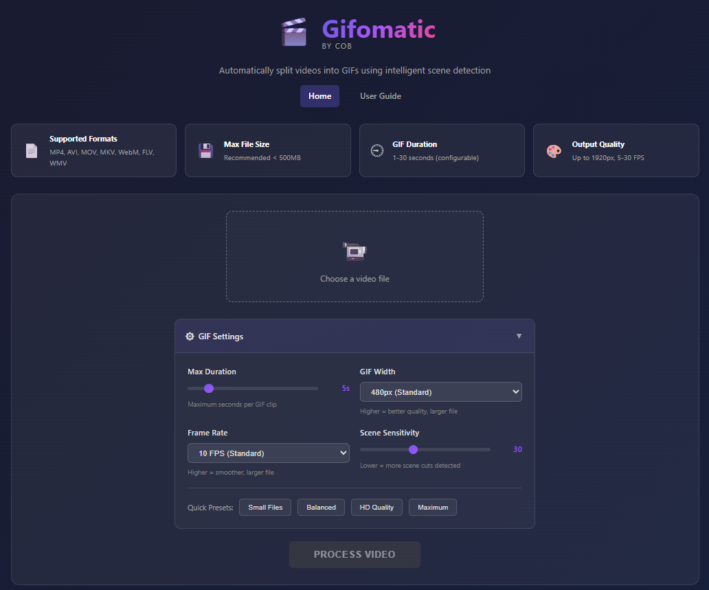

<div align="center">

# Gifomatic

**Turn any video into perfectly-timed GIFs with automatic scene detection.**

Upload a video. Get back individual scene GIFs — cropped, styled, and ready to share.


**[User Guide](/guide)** | **[Contributing](CONTRIBUTING.md)** | **[Changelog](CHANGELOG.md)** | **[Code of Conduct](CODE_OF_CONDUCT.md)**

</div>

---

<div align="center">



*Upload → Crop → Process → Download — all in your browser*

</div>

## Quick Start

```bash
git clone https://github.com/anthropics/cob-gifomatic.git && cd cob-gifomatic
python -m venv venv && source venv/bin/activate  # or venv\Scripts\activate on Windows
pip install -r requirements.txt
python app.py                                     # → http://localhost:5000
```

> FFmpeg must be installed. See [Setup & Installation](#setup--installation) for details.

---

## Why Gifomatic?

- **Manual splitting is tedious** — scrubbing through a video to find the right timestamps, exporting each clip, converting to GIF one at a time
- **Online converters are limited** — file size caps, watermarks, no scene detection, no cropping
- **CLI tools require expertise** — FFmpeg is powerful but the command syntax for quality GIF output is complex
- **Batch workflows don't exist** — most tools convert one clip at a time with no merge or gallery features

Gifomatic handles the entire pipeline: upload a video, auto-detect scenes, crop if needed, and get back a gallery of GIFs — all in real-time from your browser.

---

## Features

| Feature | Description |
|---------|-------------|
| **Scene Detection** | PySceneDetect identifies scene changes automatically |
| **Video Cropping** | Interactive canvas crop with thumbnail preview strip |
| **Quality Presets** | Small, Balanced, HD, Maximum — or fine-tune width/FPS/duration/sensitivity |
| **High-Quality Encoding** | Two-pass palette generation with Lanczos scaling |
| **Original Resolution** | Output at native video dimensions with no rescaling |
| **Real-time Streaming** | GIFs appear as they're generated via SSE |
| **Lightbox Gallery** | Click any GIF for fullscreen view with keyboard navigation |
| **Merge GIFs** | Concatenate selected GIFs into a single continuous animation |
| **Grayscale** | Convert any GIF to black and white with one click |
| **Batch Selection** | Select multiple GIFs with Select All / Unselect All |
| **Batch Download** | Download individual, selected, or all GIFs at once |
| **Delete GIFs** | Remove unwanted GIFs directly from the interface |
| **Smart Caching** | Same video + same settings + same crop = instant reload |
| **Responsive Design** | Works on desktop and mobile devices |
| **Privacy First** | Everything runs locally — videos deleted after processing |
| **User Guide** | Built-in comprehensive tutorial and documentation |

---

## Usage

### Workflow

```
1. Upload       → drag-and-drop or file picker (MP4, AVI, MOV, MKV, WebM, FLV, WMV)
2. Crop          → optional region selection on thumbnail preview canvas
3. Configure     → adjust quality settings or pick a preset
4. Process       → click Start, watch GIFs appear in real-time
5. Manage        → select, merge, convert to grayscale, delete
6. Download      → individual GIFs, selected batch, or all at once
```

### API Endpoints

| Endpoint | Method | Description |
|----------|--------|-------------|
| `/` | GET | Main application |
| `/guide` | GET | Built-in user guide |
| `/upload-preview` | POST | Upload video, get metadata + thumbnails |
| `/start-processing` | POST | Process with settings and optional crop |
| `/stream/<job_id>` | GET | SSE stream for real-time updates |
| `/merge` | POST | Merge selected GIFs |
| `/grayscale` | POST | Convert a GIF to grayscale |
| `/delete` | POST | Delete a GIF |
| `/jobs` | GET | List all processed jobs |
| `/load/<job_id>` | GET | Load existing job results |
| `/output/<job_id>/<filename>` | GET | Serve generated GIF files and thumbnails |

---

## Configuration

All settings live in `config.py` and are overridable via environment variables or a `.env` file.

```bash
cp .env.example .env    # copy template
nano .env               # edit as needed
python app.py           # loads .env automatically
```

### UI Settings (adjustable per session)

| Setting | Range | Default | Description |
|---------|-------|---------|-------------|
| Max Duration | 1–30 sec | 5 sec | Max GIF length before scene splitting |
| GIF Width | 320–1920 px | 480 px | Output width (height auto-scales) |
| Frame Rate | 5–30 FPS | 10 FPS | Higher = smoother, larger files |
| Scene Sensitivity | 10–60 | 30 | Lower = more cuts detected |

**Quick Presets:** Small (320px/5fps/3s) · Balanced (480px/10fps/5s) · HD (720px/15fps/5s) · Maximum (1080px/24fps/10s)

### Server Settings (via `.env`)

| Variable | Default | Description |
|----------|---------|-------------|
| `SECRET_KEY` | auto-generated | Session encryption key (set for production) |
| `FLASK_ENV` | production | `development` enables debug mode |
| `HOST` | 0.0.0.0 | Server bind address |
| `PORT` | 5000 | Server port |
| `MAX_UPLOAD_SIZE` | 5368709120 (5GB) | Maximum upload size in bytes |
| `RATE_LIMIT_WINDOW` | 60 | Rate limit window in seconds |
| `RATE_LIMIT_MAX_REQUESTS` | 10 | Max API requests per window per IP |
| `RATE_LIMIT_MAX_UPLOADS` | 3 | Max uploads per window per IP |
| `MAX_CONCURRENT_JOBS` | 5 | Simultaneous processing jobs |
| `JOB_EXPIRY_HOURS` | 0 | Auto-cleanup hours (0 = never) |
| `MAX_JOBS_STORED` | 100 | Max cache entries |
| `MAX_VIDEO_DURATION` | 10800 (3hr) | Max video length in seconds (0 = no limit) |
| `MAX_CLIPS` | 0 | Max clips per video (0 = no limit) |
| `MAX_MERGE_GIFS` | 20 | Max GIFs per merge |
| `DEFAULT_GIF_DURATION` | 5.0 | Default max seconds per GIF |
| `DEFAULT_GIF_FPS` | 10 | Default frames per second |
| `DEFAULT_GIF_WIDTH` | 480 | Default width in pixels |
| `DEFAULT_SCENE_THRESHOLD` | 30 | Default scene detection sensitivity |
| `THUMBNAIL_COUNT` | 4 | Preview thumbnails for crop UI |
| `THUMBNAIL_WIDTH` | 640 | Thumbnail width in pixels |
| `MIN_CROP_SIZE` | 64 | Minimum crop region in pixels |
| `FFMPEG_TIMEOUT` | 60 | Per-GIF FFmpeg timeout (seconds) |
| `FFMPEG_MERGE_TIMEOUT` | 300 | Merge FFmpeg timeout (seconds) |

> Setting `MAX_VIDEO_DURATION`, `MAX_CLIPS`, or `JOB_EXPIRY_HOURS` to `0` disables that limit.

**Considerations:**
- **Processing Time** — depends on video length, quality settings, and system resources
- **GIF File Size** — higher resolution and FPS create significantly larger files
- **Memory Usage** — large videos with many clips consume more RAM during processing

---

## Setup & Installation

### Prerequisites

FFmpeg and FFprobe are required. Install for your platform:

| Platform | Command |
|----------|---------|
| **Windows** (winget) | `winget install ffmpeg` |
| **Windows** (choco) | `choco install ffmpeg` |
| **macOS** | `brew install ffmpeg` |
| **Ubuntu/Debian** | `sudo apt install ffmpeg` |
| **Fedora** | `sudo dnf install ffmpeg` |
| **Arch** | `sudo pacman -S ffmpeg` |

```bash
ffmpeg -version   # verify installation
```

### Option 1: Virtual Environment

```bash
git clone https://github.com/anthropics/cob-gifomatic.git
cd cob-gifomatic
python -m venv venv
source venv/bin/activate          # Linux/macOS
# source venv/Scripts/activate    # Windows Git Bash
# venv\Scripts\activate           # Windows CMD
pip install -r requirements.txt
python app.py                     # → http://localhost:5000
```

### Option 2: Docker

```bash
# Docker Compose (recommended)
docker-compose up --build         # or -d for detached

# Docker directly
docker build -t gifomatic .
docker run -p 5000:5000 -v $(pwd)/output:/app/output gifomatic
```

---

## Security

| Feature | Description |
|---------|-------------|
| **Path Traversal Protection** | All file paths validated against directory escape |
| **UUID Validation** | Job IDs must be valid UUIDs |
| **Magic Byte Checking** | File type validated beyond extension |
| **XSS Prevention** | Safe DOM manipulation, no innerHTML for user data |
| **Rate Limiting** | Configurable per-IP request and upload limits |
| **Security Headers** | CSP, X-Frame-Options, X-Content-Type-Options |
| **Error Sanitization** | No internal paths or system info in error messages |

**Privacy:** Your data stays local. Videos are deleted after processing, GIFs are stored in `output/`, no data is sent to external servers. Cache is file-based (`cache.json`), not cloud-synced.

**Production checklist:**
```bash
export SECRET_KEY="your-secure-random-key"    # required
export FLASK_ENV=production                    # disable debug
# deploy behind reverse proxy (nginx/Caddy) with TLS
# consider adding authentication if exposing publicly
```

---

## FAQ

**Q: What video formats are supported?**
MP4, AVI, MOV, MKV, WebM, FLV, and WMV.

**Q: Where are my GIFs stored?**
Locally in the `output/` folder. Nothing is sent to external servers.

**Q: Are uploaded videos kept?**
No. Source videos are deleted immediately after processing.

**Q: Why are my GIFs grainy?**
Gifomatic uses two-pass palette generation for best quality. Try increasing width or FPS for better results, but note larger file sizes.

**Q: Can I run this on a server for my team?**
Yes. Deploy with Docker, set a `SECRET_KEY`, and put it behind a reverse proxy with TLS. Consider adding authentication if exposed publicly.

**Q: Processing seems slow?**
Speed depends on video length, quality settings, and hardware. SSDs and more RAM help. Reduce resolution or FPS for faster output.

**Q: GIFs not generating?**
Check the terminal for error messages. Ensure the video format is supported and try a smaller file first.

**Q: FFmpeg not found?**
Ensure FFmpeg is installed and in your system PATH. Restart your terminal after installation. Run `ffmpeg -version` to verify.

---

## Contributing

```bash
git clone https://github.com/anthropics/cob-gifomatic.git
cd cob-gifomatic
python -m venv venv && source venv/bin/activate
pip install -r requirements.txt
python app.py                     # test your changes at localhost:5000
```

1. Fork the repository
2. Create your feature branch (`git checkout -b feature/AmazingFeature`)
3. Make your changes and update `CHANGELOG.md`
4. Commit (`git commit -m 'feat: add amazing feature'`)
5. Push and open a Pull Request

See [CONTRIBUTING.md](CONTRIBUTING.md) and [Code of Conduct](CODE_OF_CONDUCT.md) for full guidelines.

---

## About

Built by [Call O Buzz Services](https://callobuzz.com)

## License

MIT
